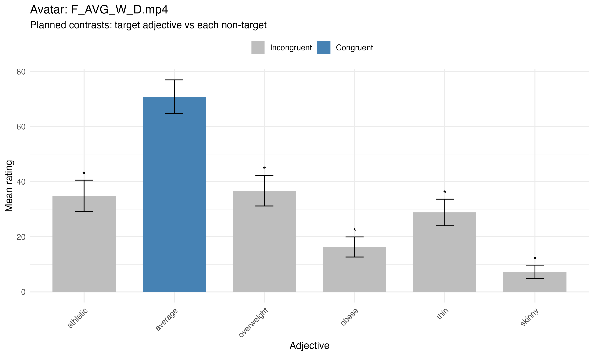

---
output:
  html_document:
    includes:
      before_body: assets/header.html
---
<div style="
  margin-top:18px;
  font-size:16px;
  font-weight:600;
  color:#5a2d82;
  letter-spacing:0.5px;
">
02_processing.Rmd — Statistical Report
</div>

</div>

# 1. Introduction

This project is part of a pre-manipulation study designed to validate dynamic avatar stimuli before their use in a larger experiment on social perception of body morphology in sports students. The main goal was to determine whether participants’ perceptual judgments matched the intended body morphology represented by each avatar.

This report presents the dataset, preprocessing pipeline, statistical analyses, and validation results. In accordance with the course requirements, the document focuses on the technical and analytical aspects of the project rather than on an extended theoretical discussion.

# 2. Scientific Question

The scientific question underlying this pre-study was the following:

**Are animated avatars representing distinct body morphology categories perceived according to their intended morphology labels?**

More specifically, the project aimed to assess whether avatars designed to represent six categories — skinny, thin, average, athletic, overweight, and obese — were rated highest on their congruent adjective compared with the five incongruent adjectives.

This validation step was necessary before selecting the most representative and perceptually distinct stimuli for the main study on social perception of body morphology in sports students.

# 3. Data

## Study design

This observational pilot study was conducted online using **SoSci Survey**. Participants viewed a set of 12 animated avatars (6 female and 6 male), with two avatars per body morphology category. All avatars performed a standardized walking-in-place animation displayed in a continuous loop.

For each avatar, participants rated six morphology adjectives on a continuous slider scale ranging from **1 (“Not at all”)** to **101 (“Completely”)**.

The six evaluated morphology dimensions were:

- skinny
- thin
- average
- athletic
- overweight
- obese

The order of avatar presentation was randomized across participants. In addition, the order of adjective ratings was randomized within each avatar in order to reduce order effects.

## Sample

Participants were recruited online through university mailing lists and personal networks.

Inclusion criteria were:

- age ≥ 18 years
- fluency in French
- no self-reported history of clinically significant body image or eating disorder difficulties

The target sample size was **20 participants** (10 men, 10 women).

## Raw data structure

The raw questionnaire export contained:

- participant-level information (demographic and questionnaire variables)
- the randomized avatar identifiers displayed in each presentation slot
- the corresponding ratings for each adjective

More specifically, the dataset included:

- `VI03_01` to `VI03_12`: avatar identifiers shown in each slot
- `PM01_01` to `PM72_01`: 72 ratings corresponding to 12 blocks of 6 adjectives

Because the avatar order was randomized, preprocessing was required to reconstruct the mapping between avatar identity and adjective-based ratings.

# 4. Analytical Pipeline

## Preprocessing

The preprocessing stage was implemented in `01_preprocessing.R`.

Its objective was to reconstruct the correspondence between:

- the avatar displayed in each randomized slot
- the six ratings associated with that slot

The script:

1. imported the raw Excel questionnaire file from `DAT/raw/`
2. identified avatar columns (`VI03_*`) and rating columns (`PM*_01`)
3. reconstructed slot-level adjective ratings
4. reshaped the dataset into **long format**
5. exported the cleaned dataset into `DAT/clean/`

The resulting object, `ratings_long`, contained one row per participant × avatar × adjective.

## Data restructuring logic

The preprocessing relied on the fact that each slot was associated with exactly six adjective ratings. A dedicated helper function retrieved the six `PM` columns associated with each slot, and the dataset was then pivoted into long format using `pivot_longer()`.

This step was necessary because the raw data were not directly organized by avatar identity, but by presentation order.

## Outputs

The preprocessing script generated:

- `pre_manip_ratings.rdata`
- `pre_manip_ratings.csv`
- `pre_manip_ratings.xlsx`

These files were saved in `DAT/clean/` and used as input for the statistical report.

# 5. Statistical Analyses

## Data preparation

The statistical analyses were implemented in `02_statistics.Rmd`.

The cleaned dataset was first checked for structural consistency, including the expected number of rows per participant. Variable types were then explicitly defined:

- `CASE` as participant identifier
- `adjectif` as factor
- `note` as numeric rating
- demographic variables as numeric where relevant

Participants reporting clinically significant body image or eating disorder difficulties were excluded prior to analysis.

## Descriptive statistics

Descriptive analyses were computed at several levels:

- participant demographics
- mean ratings by avatar and adjective
- validation summary for each avatar

These descriptive statistics were useful to verify the general coherence of the data before inferential testing.

## Validation logic

Each avatar was associated with a target morphology label extracted from its filename (e.g., `_ATH_`, `_AVG_`, `_THIN_`).

A congruence variable was then defined:

- **congruent**: adjective matches intended avatar morphology
- **incongruent**: adjective does not match intended morphology

## Inferential model

For each avatar, a **repeated-measures ANOVA** tested the global effect of adjective on rating scores.

If an adjective effect was present, **planned contrasts** were computed to compare:

- the congruent adjective
- each of the five incongruent adjectives

Holm correction was applied to adjust for multiple comparisons.

An avatar was considered **validated** if the congruent adjective was rated significantly higher than all five incongruent adjectives.

# 6. Results

## Descriptive outputs

The analysis produced descriptive tables summarizing mean ratings by avatar and adjective, as well as participant-level summary information after exclusions.

These outputs confirmed that the dataset was correctly structured and suitable for within-avatar repeated-measures analyses.

## Validation results

The repeated-measures ANOVAs and planned contrasts were computed separately for each avatar.

The final validation summary indicated, for each avatar:

- the number of planned contrasts tested
- the number of significant contrasts
- whether all contrasts were significant after correction

This allowed a direct selection of the avatars that best matched their intended morphology labels.

## Figures

The project generated one plot per avatar showing:

- mean adjective ratings
- standard error of the mean
- congruent vs incongruent highlighting
- significance labels from the planned contrasts

These visualizations were exported in `RES/plots_avatar/`.

**Figure 1. Example of avatar validation plot.**

```{r example-plot, echo=FALSE, out.width="80%", fig.align="center"}
