---
output:
  html_document:
    toc: true
    toc_depth: 3
    toc_float:
      collapsed: true
      smooth_scroll: true
    number_sections: true
    includes:
      before_body: assets/header.html
---
<div style="
  margin-top:18px;
  font-size:16px;
  font-weight:600;
  color:#5a2d82;
  letter-spacing:0.5px;
">
Scientific Report
</div>


# Introduction

This project is part of a pilot study designed to validate dynamic avatar stimuli before their use in a larger experiment on social perception of body morphology in sports students. The main goal was to determine whether participants’ perceptual judgments matched the intended body morphology represented by each avatar.

This report presents the dataset, preprocessing pipeline, statistical analyses, and validation results.

# Scientific Question

The scientific question underlying this pilot study was the following:

**Are animated avatars representing distinct body morphology categories perceived according to their intended morphology labels?**

More specifically, the project aimed to assess whether avatars designed to represent six categories (underweight, thin, average, athletic, overweight, and obese) were rated highest on their congruent adjective compared with the five incongruent adjectives.

This validation step was necessary before selecting the most representative and perceptually distinct stimuli for the main study on social perception of body morphology in sports students.

# Data

## Study design

This observational pilot study was conducted online using **SoSci Survey**. Participants viewed a set of 12 animated avatars, coresponding to six body morphologies, each represented by one male and one female avatar. All avatars performed a standardized walking-in-place animation displayed in a continuous loop.

For each avatar, participants rated six morphology adjectives on a continuous slider scale ranging from **1 (“Not at all”)** to **101 (“Completely”)**.

The six evaluated morphology dimensions were:

- underweight
- thin
- average
- athletic
- overweight
- obese

The order of avatar presentation was randomized across participants. In addition, the order of adjective ratings was randomized within each avatar in order to reduce order effects.

## Sample

Inclusion criteria were:

- age ≥ 18 years
- fluency in French
- no self-reported history of clinically significant body image disturbances or eating disorders (variable `DE10`), as such conditions are known to affect body perception and could bias the evaluation of avatar morphology (Vocks and al., 2007)

The target sample size was **20 participants** (10 men, 10 women).

## Raw data structure

The raw questionnaire export contained:

- participant-level information (demographic and questionnaire variables)
- the randomized avatar identifiers displayed in each presentation slot
- the corresponding ratings for each adjective

More specifically, the dataset included:

- `VS03_01` to `VS03_12`: avatar identifiers shown in each slot
- `PM01_01` to `PM72_01`: 72 ratings corresponding to 12 blocks of 6 adjectives

Because the avatar order was randomized, preprocessing was required to reconstruct the mapping between avatar identity and adjective-based ratings.

# Analytical Pipeline

## Preprocessing

The preprocessing stage was implemented in `01_preprocessing.R`.

Its objective was to reconstruct the correspondence between:

- the avatar displayed in each randomized slot
- the six ratings associated with that slot

The script performed the following steps:

1. imported the raw questionnaire file from `DAT/raw/` (.xls format)
2. identified avatar columns (`VS03_*`) and rating columns (`PM*_01`)
3. reconstructed the mapping between each avatar and its corresponding ratings
4. reshaped the dataset into **long format** (one row per observation)
5. exported the cleaned dataset into `DAT/clean/`

The resulting dataset, `ratings_long`, contained one row per participant × avatar × adjective, in order to run statistical analyses.

## Outputs

The preprocessing script generated:

- `pre_manip_ratings.rdata`
- `pre_manip_ratings.csv`
- `pre_manip_ratings.xlsx`

These files were saved in `DAT/clean/` and used as input for the statistical report.

# Statistical Analyses

## Data preparation

The statistical analyses were implemented in `02_statistics.Rmd`.

The cleaned dataset was first checked for structural consistency, including the expected number of observations per participant.

Variable types were then explicitly defined:
- `CASE` as factor (participant identifier)
- `adjectif` as factor
- `note` as numeric rating
- demographic variables as numeric (age, gender)

## Descriptive statistics

Descriptive analyses were computed:

- participant demographics
- mean ratings by avatar and adjective
- validation summary for each avatar

These descriptive statistics were useful to verify the general coherence of the data before inferential testing.

## Validation logic

Each avatar was associated with a target morphology label extracted from its filename (e.g., `_ATH_`, `_AVG_`, `_THIN_`).

A congruence variable was then defined:

- **congruent**: adjective matches intended avatar morphology
- **incongruent**: adjective does not match intended morphology

In some parts of the report and analysis, the term **skinny** is used to refer to the **underweight** category.

## Inferential statistics

For each avatar, a **repeated-measures ANOVA** was conducted to test the effect of adjective on rating scores. This analysis was conducted within a within-subject design, as each participant rated all avatars and adjectives.

If an adjective effect was present, **planned contrasts** were computed to compare:

- the congruent adjective
- each of the five incongruent adjectives

Holm correction was applied to adjust for multiple comparisons.

An avatar was considered **validated** if the congruent adjective was rated significantly higher than all five incongruent adjectives.

# Results

## Descriptive outputs

The analysis produced descriptive tables summarizing mean ratings by avatar and adjective, as well as participant-level summary information after exclusions.

These outputs confirmed that the dataset was correctly structured and suitable for within-avatar repeated-measures analyses.

```{r tables descriptives 1, echo=FALSE, fig.align="center", out.width="50%", fig.cap="Table 1. Demographic characteristics of the final included sample"}
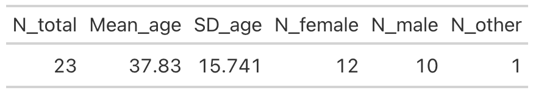
```

## Validation results

The repeated-measures ANOVAs and planned contrasts were computed separately for each avatar.

The final validation summary indicated, for each avatar:

- the number of planned contrasts tested
- the number of significant contrasts
- whether all contrasts were significant after correction

This allowed a direct identification of the avatars that best matched their intended morphology labels and helped identify which avatars might require further adjustment prior to the main experiment.

```{r tables validation, echo=FALSE, fig.align="center", out.width="50%", fig.cap="Table 2. Validation summary for each avatar"}
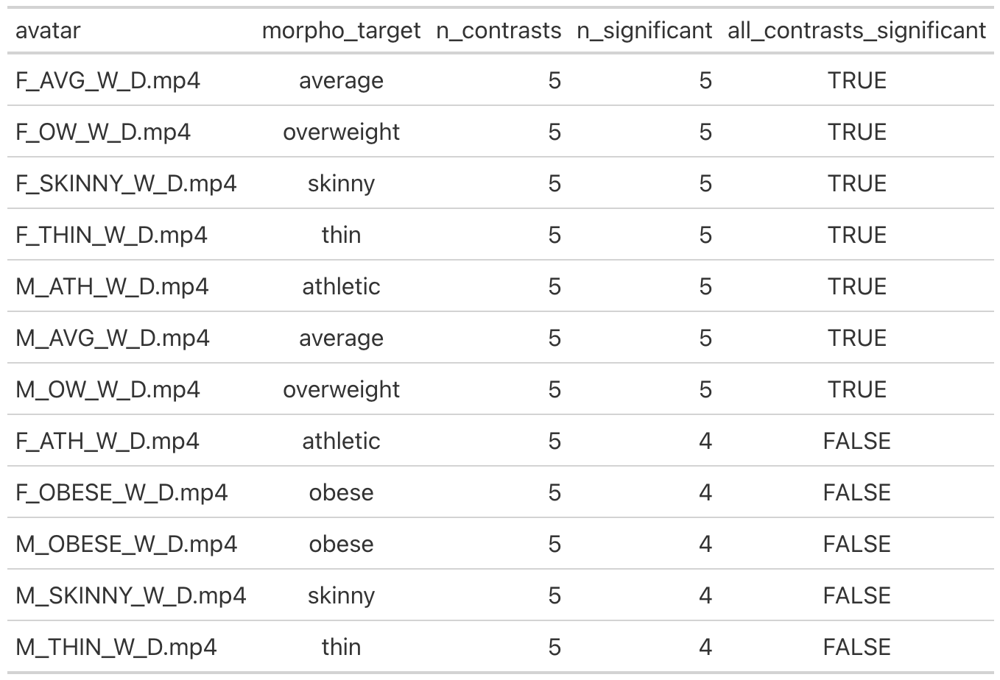
```
## Figures

The project generated one plot per avatar showing:

- mean adjective ratings
- standard error of the mean
- congruent vs incongruent highlighting
- significance labels from the planned contrasts

These visualizations were exported in `RES/plots_avatar/`.

**Figure 1. Female-UW avatar validation plot.**
```{r plot 1, echo=FALSE, out.width="80%", fig.align="center"}
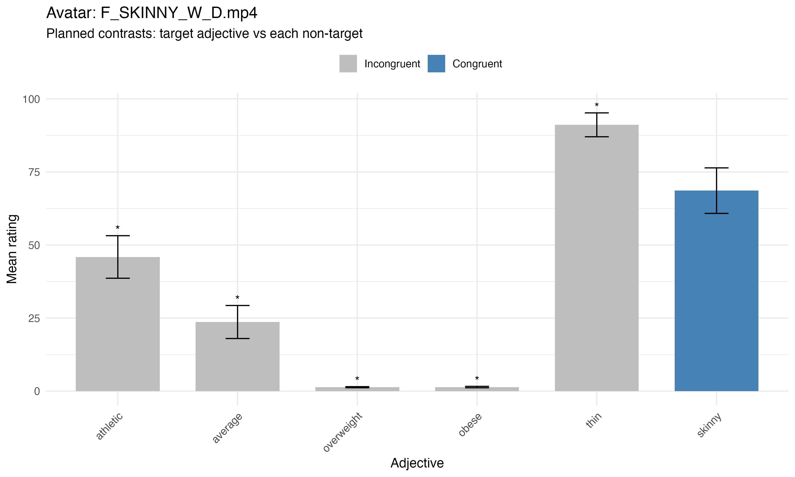
```

**Figure 2. Female-THIN avatar validation plot.**
```{r plot 2, echo=FALSE, out.width="80%", fig.align="center"}
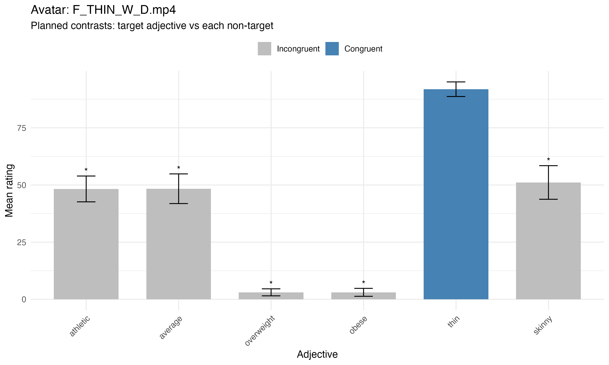
```

**Figure 3. Female-AVG avatar validation plot.**
```{r plot 3, echo=FALSE, out.width="80%", fig.align="center"}
knitr::include_graphics("RES/plots_avatar/plot_F_AVG_W_D_mp4.png")
```

**Figure 4. Female-ATH avatar validation plot.**
```{r plot 4, echo=FALSE, out.width="80%", fig.align="center"}
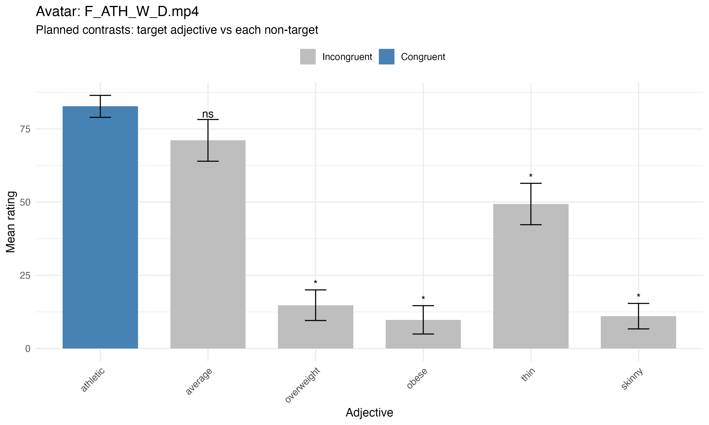
```

**Figure 5. Female-OW avatar validation plot.**
```{r plot 5, echo=FALSE, out.width="80%", fig.align="center"}
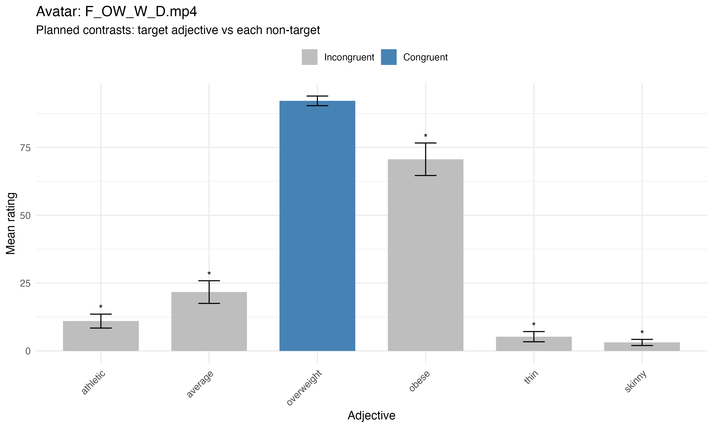
```

**Figure 6. Female-OBESE avatar validation plot.**
```{r plot 6, echo=FALSE, out.width="80%", fig.align="center"}
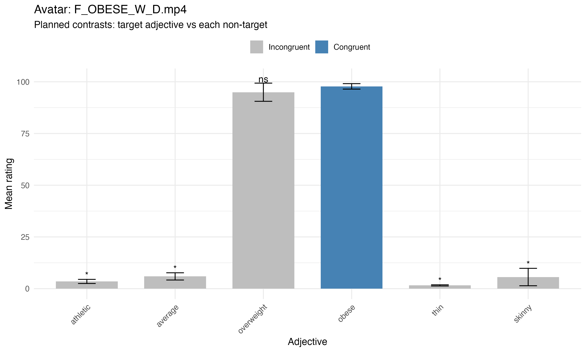
```

**Figure 7. Male-UW avatar validation plot.**
```{r plot 7, echo=FALSE, out.width="80%", fig.align="center"}
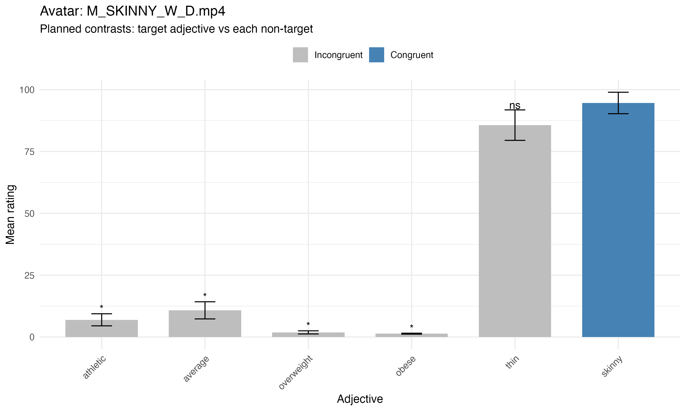
```

**Figure 8. Male-THIN avatar validation plot.**
```{r plot 8, echo=FALSE, out.width="80%", fig.align="center"}
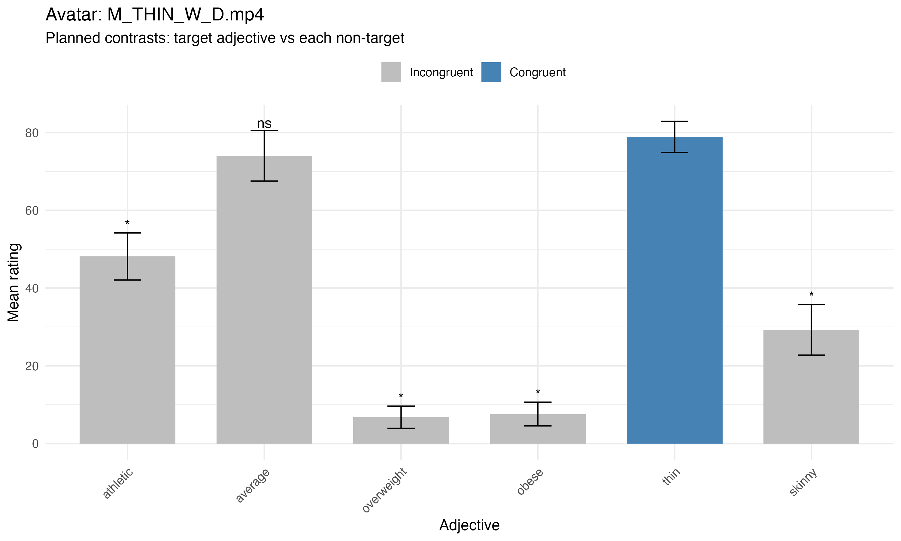
```

**Figure 9. Male-AVG avatar validation plot.**
```{r plot 9, echo=FALSE, out.width="80%", fig.align="center"}
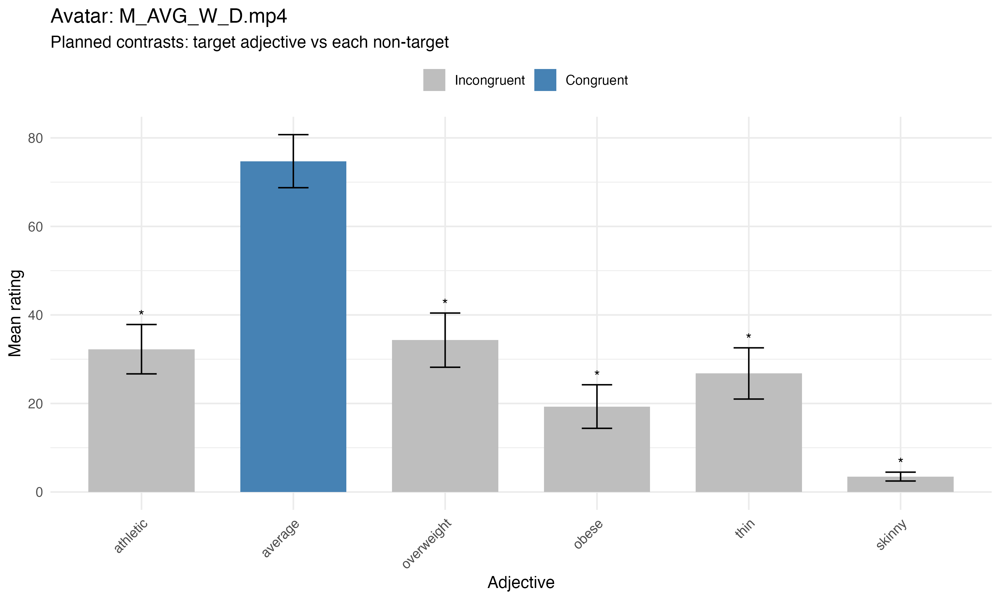
```

**Figure 10. Male-ATH avatar validation plot.**
```{r plot 10, echo=FALSE, out.width="80%", fig.align="center"}
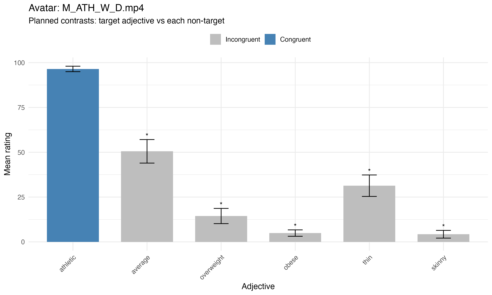
```

**Figure 11. Male-OW avatar validation plot.**
```{r plot 11, echo=FALSE, out.width="80%", fig.align="center"}
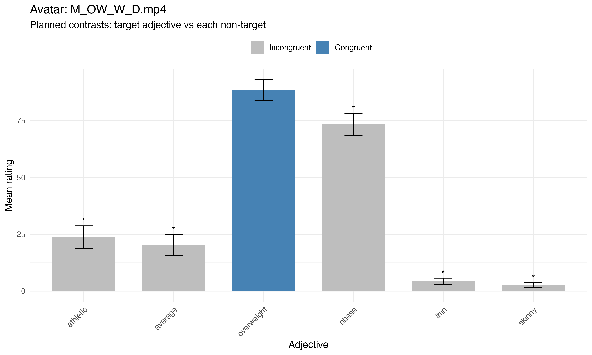
```

**Figure 12. Male-OBESE avatar validation plot.**
```{r plot 12, echo=FALSE, out.width="80%", fig.align="center"}
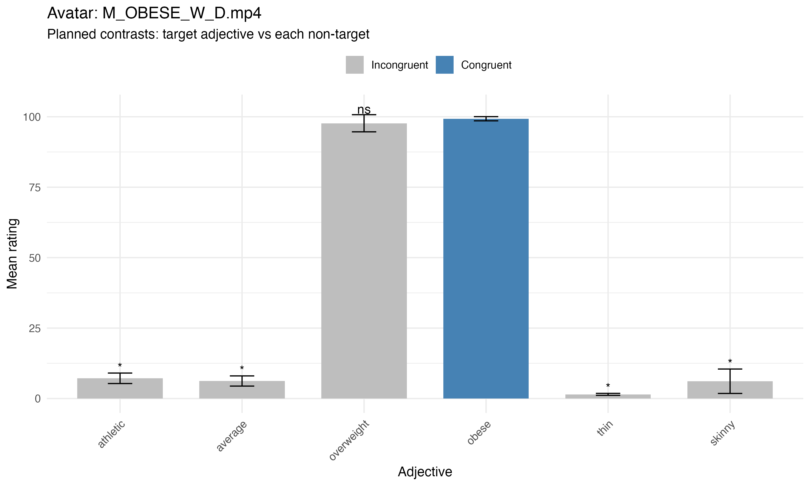
```

## Discussion - Stimulus Validation
The present pilot study aimed to verify whether the dynamic avatars were perceived in accordance with their intended body morphology categories. Overall, the results indicate that most avatars were successfully recognized according to their target adjective (F-Thin, F-Avg, F-Overweight, M-Thin, M-Avg, M-Ath, M-Overweight).

For the two extreme body morphology categories (obese and underweight), not all planned contrasts reached statistical significance. Specifically, ratings for these avatars did not differ significantly from the adjective representing the adjacent morphology category (i.e., overweight for the obese avatar and thin for the underweight avatar). This result was expected given the structure of the rating task, as these adjectives represent neighbouring points along a continuous body-size spectrum.

Importantly, the avatars corresponding to the intermediate categories (overweight and thin) were not perceived as the extreme morphologies (obese and underweight). This pattern suggests that participants were still able to differentiate the most extreme body types from the more moderate categories, even when the distinction between adjacent categories was not always statistically significant. Taken together, these results support the validity of the "extreme avatar morphologies" and justify their use as stimuli in the main experiment (F-Obese, M-UW, M-Obese).

**Special Cases:**
The athletic female avatar was not significantly differentiated from the average morphology. To improve perceptual distinction between these categories, the muscularity of the avatar was increased. The validation procedure was then rerun on the adjusted avatar, which successfully reached validation criteria (c.f **Fig. 14**).

In addition, the female underweight avatar was perceived significantly as thin and received higher thin ratings than the original thin avatar. This avatar was therefore retained as the thin morphology. A new underweight avatar was therefore created and subsequently validated in the final version by examining the difference in ratings between the thin and underweight categories, as previously described (c.f **Fig. 15 and 16**).

For the male avatars, the thin morphology was not significantly differentiated from the average category. The avatar was therefore slightly modified by reducing body mass to increase perceptual differentiation between these morphologies. The validation procedure was then rerun on the adjusted avatar, which successfully reached validation criteria (c.f **Fig. 13**).

**Final validation with modifications:**
```{r tables descriptives 3, echo=FALSE, fig.align="center", out.width="50%", fig.cap="Table 2. Demographic characteristics of the final included sample for modified version"}
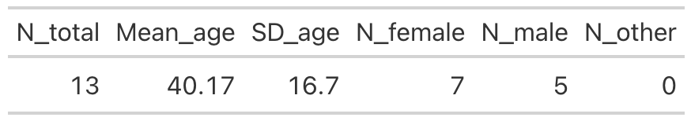
```

**Figure 13. Male-THIN avatar validation plot (modified version).**
```{r plot 13, echo=FALSE, out.width="80%", fig.align="center"}
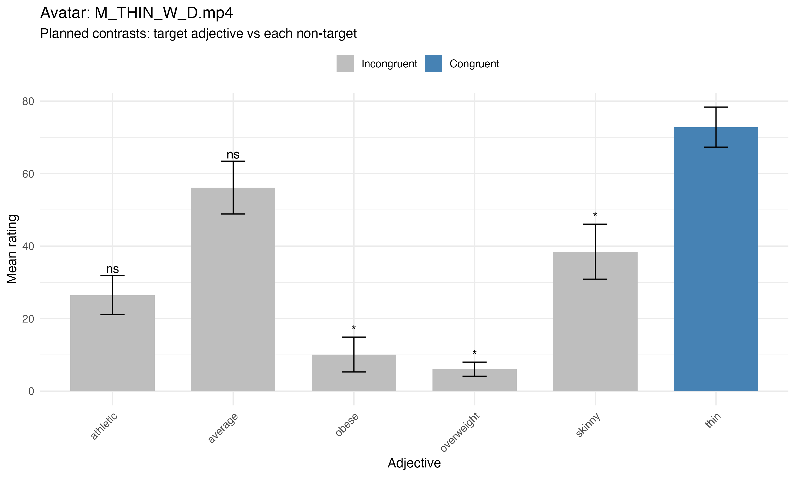
```

**Figure 14. Female-ATH avatar validation plot (modified version).**
```{r plot 14, echo=FALSE, out.width="80%", fig.align="center"}
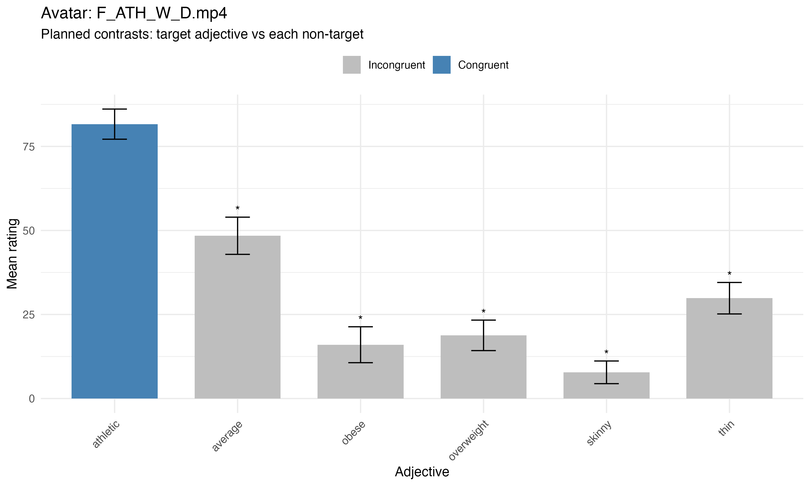
```

**Figure 15. Female-UW avatar validation plot (modified version).**
```{r plot 15, echo=FALSE, out.width="80%", fig.align="center"}
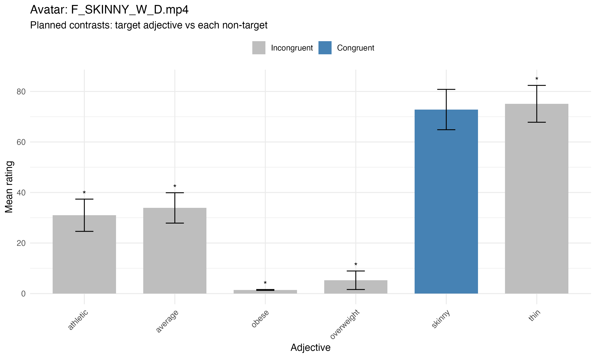
```

**Figure 16. Female-THIN avatar validation plot (modified version).**
```{r plot 16, echo=FALSE, out.width="80%", fig.align="center"}
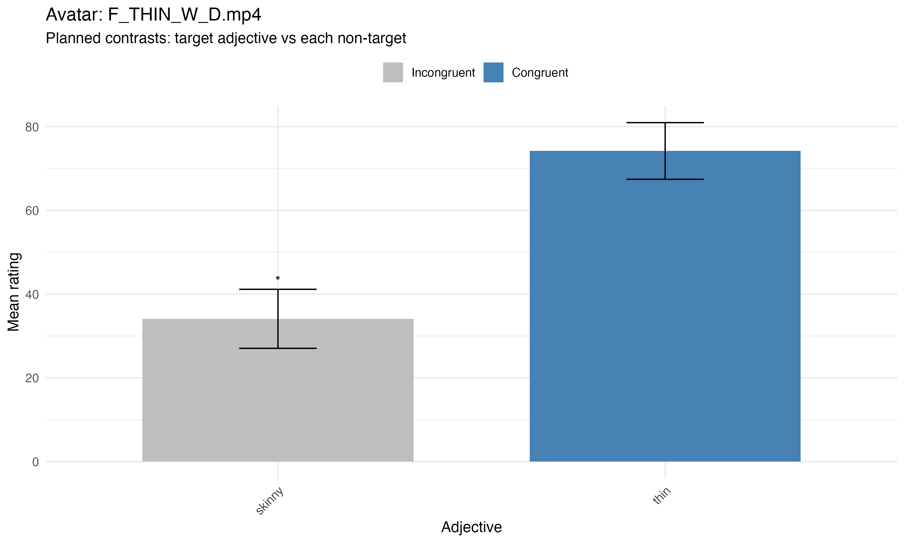
```