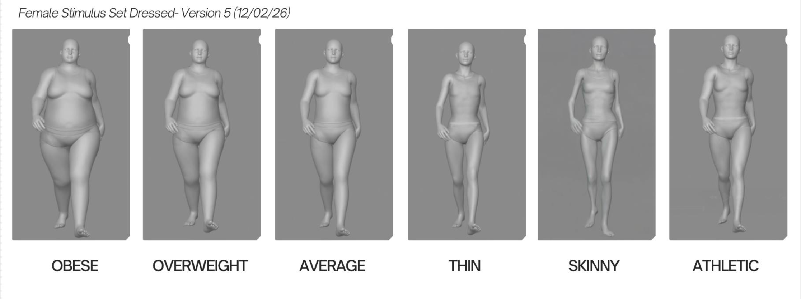
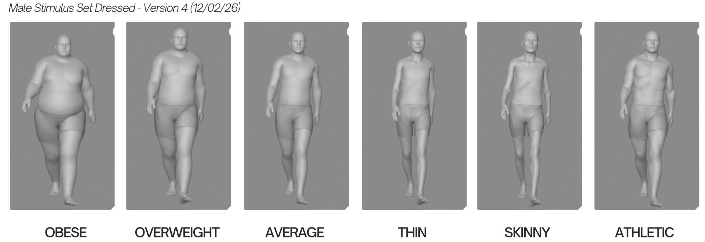

## Study Overview

This pre-study was conducted to validate a set of dynamic avatars representing different body morphology categories. The objective was to ensure that the adjectives describing body size accurately matched participants’ perceptual judgments before inclusion in the main experimental study.

---

## Objectives

- Assess whether avatars representing distinct body morphologies (underweight, thin, average, athletic, overweight, obese) are perceived as intended.
- Evaluate potential perceptual overlap between body-size adjectives.
- Select the most representative and perceptually distinct avatars for the main study.

---

## Study Design

This observational pilot study was conducted online using SoSci Survey.

Participants rated 12 animated avatars (6 female, 6 male) per morphology category:

- Underweight  
- Thin  
- Average  
- Athletic  
- Overweight  
- Obese  

All avatars performed a standardized walking-in-place animation displayed in a continuous loop.

For each avatar, participants evaluated six morphology adjectives using a slider scale ranging from 1 (“Not at all”) to 101 (“Completely”).

Example item:  
> “In your opinion, to what extent does this avatar appear athletic?”

The order of avatar presentation was randomized across participants. The order of adjective ratings was also randomized within each avatar.

---

## Sample

- Online recruitment (university mailing lists and personal networks)
- Inclusion criteria:
  - Age ≥ 18 years
  - Fluency in French
  - No self-reported history of clinically significant body image or eating disorder difficulties
- Target sample size: 40 participants (20 men, 20 women)

---

## Variables

### Independent Variables
- Intended body morphology category (a priori defined)
- Avatar sex (male / female)

### Dependent Variables
- Adjective-based body morphology ratings (continuous scale: 1–101)

---

## Statistical Analysis

For each avatar:

1. A repeated-measures ANOVA tested the global effect of adjective.
2. Planned contrasts compared the congruent adjective (intended morphology) to each incongruent adjective.
3. Holm correction was applied for multiple comparisons.

Avatars were considered validated if ratings on the intended adjective were significantly higher than ratings on all alternative adjectives.

---

## Repository Structure
<pre>
.
├── DAT/
│   ├── raw/
│   └── clean/
├── RES/
│   ├── plots_avatar/
│   └── stimulus set/
├── PRG/
│   ├── 01_preprocessing.R
│   └── 02_statistics.Rmd
├── main.Rmd
├── main.Rproj
|–– Hund.Delphine.html
|–– LICENCE
└── README.md
</pre>

## Reproducibility

To reproduce the analyses:

1. Open `main.Rproj`
2. Run `main.R`
3. Outputs will be generated in the `results/` folder.

---

## Final Stimulus Set (F and M)

## Reference

Voges MM, Giabbiconi C-M, Schöne B, Waldorf M, Hartmann AS and Vocks S (2019).  
*Gender Differences in Body Evaluation: Do Men Show More Self-Serving Double Standards Than Women?*  
Frontiers in Psychology, 10:544.  
https://doi.org/10.3389/fpsyg.2019.00544